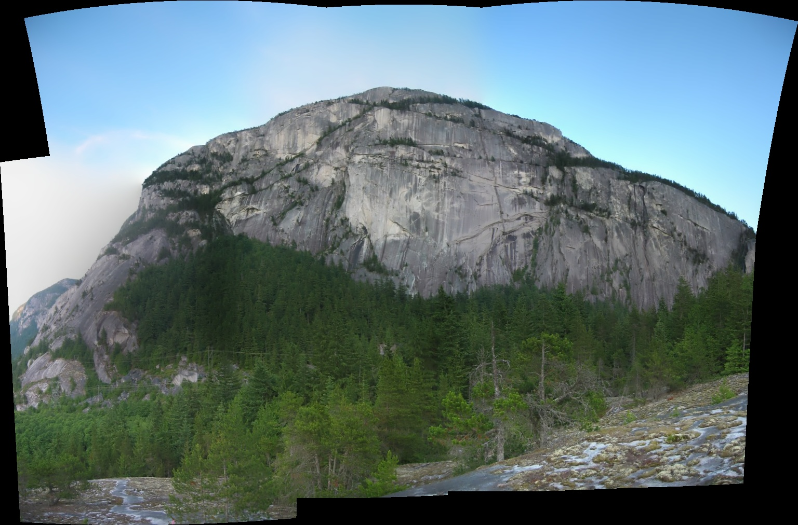

# Image Stitching Algorithm

This project demonstrates an image stitching algorithm using OpenCV to create a panorama from multiple images.

## Project Structure

```
main.py
images/
    image1.jpg
    image2.jpg
    image3.jpg
    image4.jpg
    image5.jpg
    image6.jpg
    image7.jpg
    panorama.jpg
```

- **`main.py`**: The main script that reads images, stitches them into a panorama, and displays the result.
- **`images/`**: Directory containing the input images and the output panorama.

## Requirements

- Python 3.6+
- OpenCV
- NumPy
- Matplotlib

Install the required Python packages using:

```sh
pip install opencv-python-headless numpy matplotlib
```

## Usage

1. Place the images you want to stitch in the `images/` directory.
2. Update the `image_files` list in `main.py` with the filenames of the images to be stitched.
3. Run the script:

```sh
python main.py
```

4. The resulting panorama will be saved as `images/panorama.jpg` and displayed along with the original images.

## Error Handling

The script handles the following errors:
- Missing or unreadable images.
- Insufficient images for stitching.
- Homography estimation failure.
- Camera parameter adjustment failure.

If an error occurs, it will be printed to the console.

## Example Output

After running the script, the stitched panorama will look like this (example):



## License

This project is licensed under the MIT License. See the [LICENSE](LICENSE) file for details.